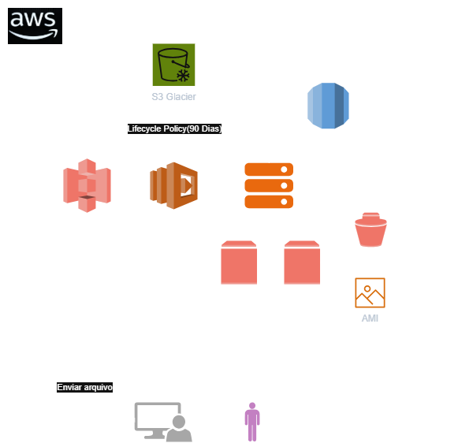

# Diagrama de Arquitetura AWS – Gerenciamento de Arquivos e Backup
Projeto desenvolvido para aplicar conceitos fundamentais da AWS através da modelagem de uma arquitetura de armazenamento, backup e gerenciamento de arquivos.

## Arquitetura

## Serviços utilizados

- Amazon S3
- AWS Lambda
- Amazon S3 Glacier
- Amazon EC2
- Amazon EBS
- EBS Snapshots
- Amazon Machine Images (AMI)
- Amazon RDS
